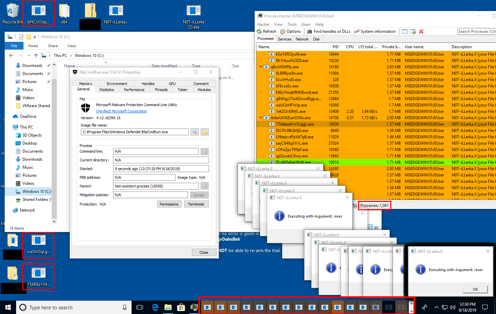

```
/-----------------------------------------------------+-------------------------------------\
|    ___    __________   __  ___          ______  ___ |  ____            ______  ___  ____  |
|   /  / __| _/\   _  \_/  |_\  \   ____ |__\   \/  / | |   _|     ____ |__\   \/  / |_   | |
|  /  / / __ | /  /_\  \   __\\  \ /    \|  |\     /  | |  |      /    \|  |\     /    |  | |
| (  ( / /_/ | \  \_/   \  |   )  )   |  \  |/     \  | |  |     |   |  \  |/     \    |  | |
|  \  \\____ |  \_____  /__|  /  /|___|  /__/___/\  \ | |  |_  /\|___|  /__/___/\  \  _|  | |
|   \__\    \/        \/     /__/      \/         \_/ | |____| \/     \/         \_/ |____| |
+-----------------------------------------------------+------------+------------------------/
| (d0t)niX [.niX] your File Killa]       [Virus.Win32.VC Type: C2] |
| by Lima X [L4X] / [G-C-E-R] © 2kl9     [dev-VER: 0.5.2 BETA-2.0] |
\------------------------------------------------------------------/
```

A C/C++ (MSVC) recreation off the original Win32.VB.Illerka.C Virus by [Michael [APFX]](https://www.youtube.com/channel/UCDo-73OtSjnMKVIEidGu2Xw) (AppleFanXXX)

Demonstration-Video of the Original:\
<a href="https://www.youtube.com/watch?v=HnRm9DBWzY8"></a>

## About this Project
I wanted to recreate the Illerka.C Virus but using more efficent C/C++ instead of Visual-Basic (in which the original was coded)\
Aswell as that I want to add more functionality to it.
 
I don't know why Im doing this (don't ask why)\
(Hint: I still don't know why, but it should give newcommers some insights into malware development)

I should also note that this project is a just-for-fun project, it's basically a playground for me to test new stuff I've learned.\
This project is also very similar to two older projects of mine:
- hDir 5: a Malware installer (this never got published on my Github but you can find the source on YouTube though)\
  compared to this project hDir 5 was a piece of garbage (well I've written it about 2 years ago which was when I started learing C/C++)
- COBRA-6: basically Illerka.C's main Payload, but poorly done (this never got published at all and probably for good,
  I don't even know if I still have the original source but Im not even sure if I want to take a second look at it.)

Also this is my first own "big" (atleast to me) project.

## Project Development Progress
- I've upgraded the User-Warning to prevent accidental continuation of execution by requiring the user to create a File with a random generated name that the Malware checks for after the user accepts the Warningmessage.

Further Information will allways be posted/updated accordingly...

## Screenshots:
First successfull launch of the Malware:\
<a></a>

## ToDo-List:
Things listed here are possible Improvements/Changes/Additions that are likely going to be made.\
If marked they're in WIP (Work in Progress)

- [x] Improve `fnMessageHandlerW`
- [x] If UAC is required launch with CMD (Stealth)
- [x] Implement Process -monitor/-iterator
- [x] Implement Registry -monitor/-iterator
- [x] Implement /exec-Watchdog
- [x] Improve Protections (watchdog - add thread that activly monitors programms like `taskmgr.exe`)
- [ ] Start to implement dropper functionality\
  (I've started to play around with DLL's and well it seems like that I'll have to explicitly link them,
  if I want to do it like I've planned/intended it to do it (if I even do it))
